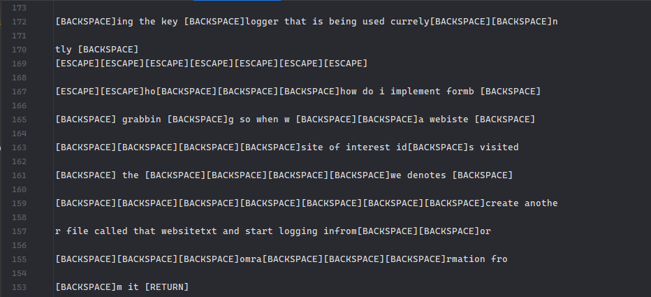

# 🤖 Windows Keylogger

***
### log file generated by the keylogger
<div align="center">
 
</div>

***

## Features

- Lightweight process
- Runs in the background

## Description
A simple keylogger designed to capture and log keystrokes on a Windows machine.

*This only works on Windows machines and is for educational purposes only*

### What is a keylogger?
Keyloggers are a type of software that captures and logs keystrokes on a computer.

They are often used for malicious purposes, such as stealing passwords or other sensitive information.


## Dependencies

To build and run this project on Windows, you need the following dependencies:

1. **CMake**: The build system used by the project.
    - Version: 3.10 or higher
    - Installation: [Download from CMake website](https://cmake.org/download/)

2. **Compiler**: A C++ compiler that supports C++17.
    - Recommended: MSVC (Microsoft Visual C++)
    - Installation: Install via Visual Studio with the C++ development tools
        - [Download Visual Studio](https://visualstudio.microsoft.com/)

## Building the Project

1. **Clone the repository**:
   ```sh
   git clone https://github.com/chrisleyvamendez/keylogger.git
   cd keylogger
